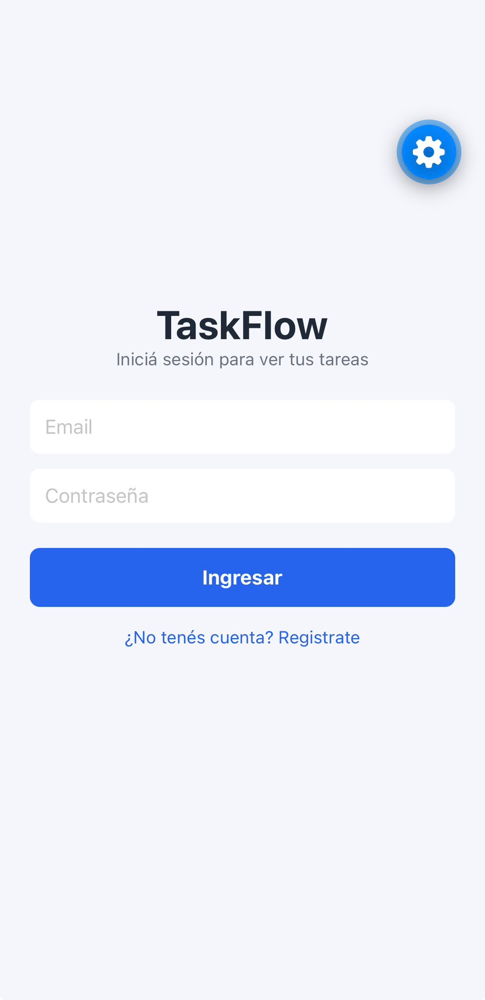
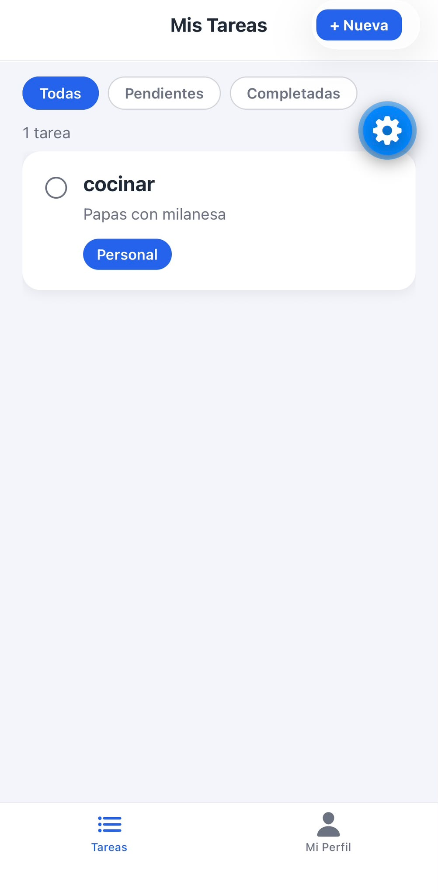
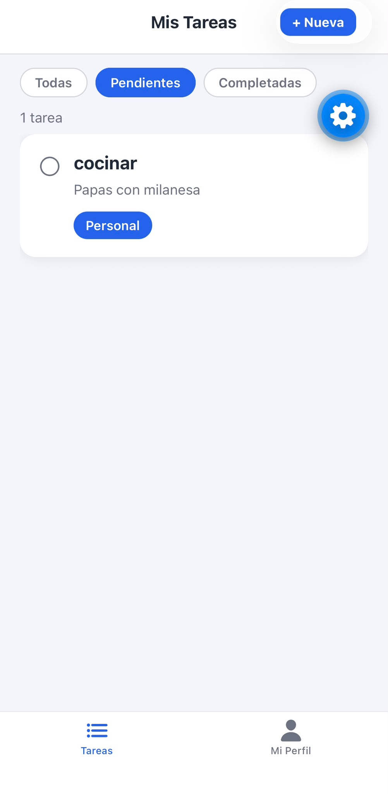
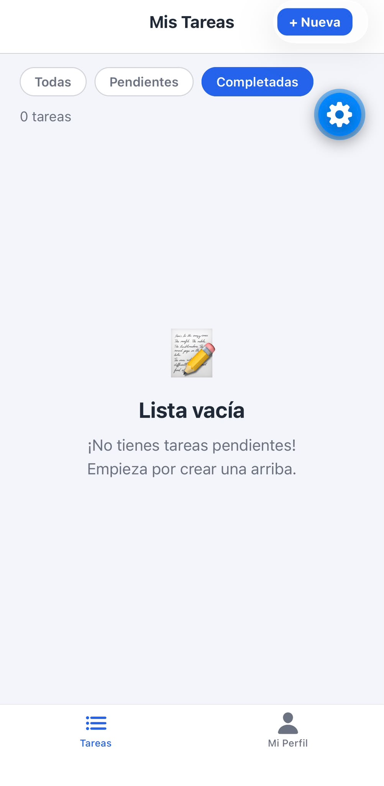
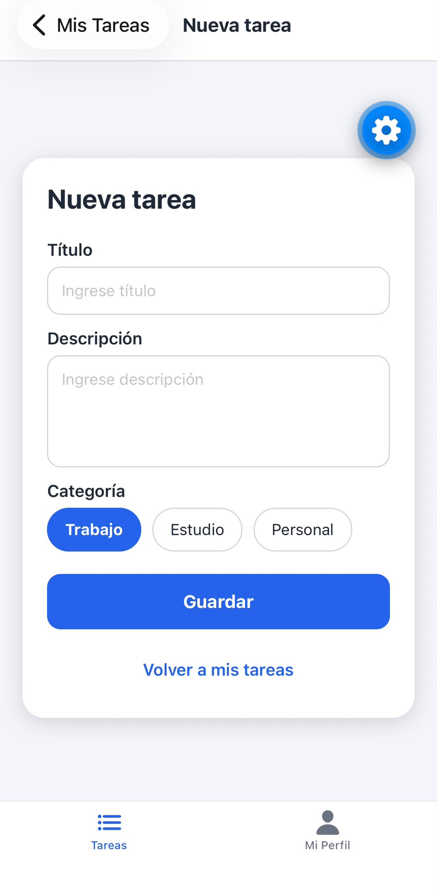
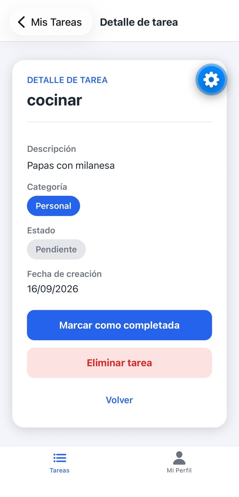
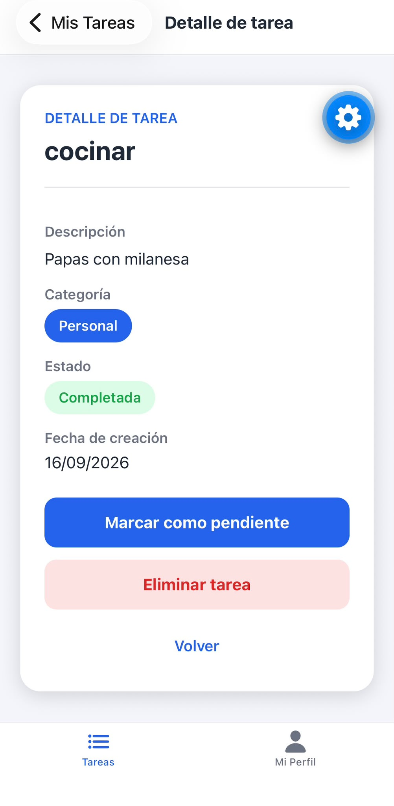

# TaskFlow

TaskFlow es una aplicación móvil desarrollada con **React Native y Expo** para organizar y gestionar tareas de forma sencilla e intuitiva.

La aplicación permite registrarse e iniciar sesión, crear y administrar tareas personales, consultar su detalle, marcar tareas como completadas y mantener la información sincronizada con Firebase.

## Tecnologías utilizadas

* React Native
* Expo
* JavaScript
* Redux Toolkit
* React Redux
* React Navigation
* Firebase Authentication
* Cloud Firestore
* AsyncStorage
* Expo Image Picker

## Funcionalidades

### Autenticación

* Registro de nuevos usuarios.
* Inicio de sesión mediante Firebase Authentication.
* Persistencia de sesión.
* Cierre de sesión.
* Protección de las pantallas privadas.
* Cada usuario accede únicamente a sus propios datos y tareas.

### Gestión de tareas

* Crear nuevas tareas.
* Visualizar las tareas del usuario autenticado.
* Consultar el detalle de una tarea.
* Marcar tareas como completadas o pendientes.
* Eliminar tareas.
* Filtrar tareas por:

  * Todas
  * Pendientes
  * Completadas

Cada tarea se almacena en **Cloud Firestore** y queda asociada al usuario autenticado mediante su `userId`.

### Sincronización en tiempo real

TaskFlow utiliza listeners de **Firestore** para mantener las tareas sincronizadas automáticamente con la base de datos.

Los cambios realizados en las tareas se reflejan en la aplicación mediante **Redux Toolkit**.

### Perfil de usuario

* Visualización de los datos del usuario.
* Selección de una imagen desde la galería.
* Solicitud de permisos para acceder a la galería.
* Visualización de la imagen seleccionada.
* Persistencia local de la imagen mediante **AsyncStorage**.
* La imagen permanece disponible al cerrar e iniciar sesión nuevamente.

### Navegación

La aplicación utiliza **React Navigation** mediante:

* Bottom Tab Navigator.
* Native Stack Navigator.
* Navegación entre lista de tareas, creación, detalle y perfil.
* Navegación protegida según el estado de autenticación.

## Estructura del proyecto

```text
TaskFlow/
├── src/
│   ├── assets/
│   ├── components/
│   ├── constants/
│   ├── navigation/
│   ├── screens/
│   ├── services/
│   └── store/
├── docs/
│   └── screenshots/
├── App.js
├── package.json
├── .gitignore
└── README.md
```

### Servicios

#### `src/services/firebase.js`

Contiene la configuración e inicialización de Firebase utilizada por la aplicación.

Incluye las conexiones necesarias para:

* Firebase Authentication.
* Cloud Firestore.

#### `src/services/authService.js`

Gestiona las operaciones relacionadas con la autenticación:

* Registro de usuarios.
* Inicio de sesión.
* Cierre de sesión.

#### `src/services/taskService.js`

Gestiona las operaciones relacionadas con las tareas:

* Obtener tareas.
* Crear tareas.
* Actualizar tareas.
* Eliminar tareas.
* Sincronización en tiempo real mediante Firestore.

### Estado global

Redux Toolkit administra el estado global de la aplicación.

```text
src/store/
├── authSlice.js
├── store.js
└── taskSlice.js
```

#### `authSlice.js`

Gestiona el estado relacionado con el usuario autenticado.

#### `taskSlice.js`

Gestiona:

* Lista de tareas.
* Filtros.
* Estado de carga.
* Errores.
* Actualización de tareas.

También contiene las operaciones asincrónicas utilizadas para interactuar con Firestore.

#### `store.js`

Configura el Redux Store y registra los reducers de la aplicación.

## Seguridad

Las tareas almacenadas en Firestore están asociadas al usuario autenticado.

Las reglas de seguridad de Firestore verifican que:

* Solo los usuarios autenticados puedan acceder a los datos.
* Cada usuario pueda consultar únicamente sus propias tareas.
* Un usuario solo pueda crear tareas utilizando su propio `userId`.
* Un usuario no pueda modificar el `userId` de una tarea.
* Solo el propietario pueda actualizar o eliminar sus tareas.
* Los datos del perfil estén protegidos mediante el UID del usuario.

La configuración de Firebase se maneja mediante variables de entorno.

El archivo `.env` está excluido del repositorio mediante `.gitignore` para evitar publicar información de configuración local.

## Instalación

Clonar el repositorio:

```bash
git clone https://github.com/JonasRomano24/TaskFlow.git
```

Ingresar al proyecto:

```bash
cd TaskFlow
```

Instalar las dependencias:

```bash
npm install
```

## Configuración de Firebase

Crear un archivo `.env` en la raíz del proyecto con las variables de configuración de Firebase:

```env
EXPO_PUBLIC_FIREBASE_API_KEY=tu_api_key
EXPO_PUBLIC_FIREBASE_APP_ID=tu_app_id
EXPO_PUBLIC_FIREBASE_AUTH_DOMAIN=tu_auth_domain
EXPO_PUBLIC_FIREBASE_MESSAGING_SENDER_ID=tu_messaging_sender_id
EXPO_PUBLIC_FIREBASE_PROJECT_ID=tu_project_id
EXPO_PUBLIC_FIREBASE_STORAGE_BUCKET=tu_storage_bucket
```

El archivo `.env` no debe subirse al repositorio.

## Ejecución

Iniciar el proyecto con:

```bash
npx expo start
```

Luego se puede ejecutar mediante:

* **Expo Go**
* **Emulador de Android**
* **Simulador de iOS** en macOS

## Capturas de pantalla

Las siguientes capturas muestran el funcionamiento de la versión final de TaskFlow.

### Autenticación

#### Inicio de sesión



#### Registro


### Gestión de tareas

#### Todas las tareas



#### Tareas pendientes



#### Tareas completadas



#### Crear nueva tarea



#### Detalle de tarea



#### Tarea completada



### Perfil


## Proyecto

**Repositorio:**
https://github.com/JonasRomano24/TaskFlow

## Autor

**Jonas Romano**

Proyecto desarrollado como parte de la formación en desarrollo de aplicaciones móviles.
