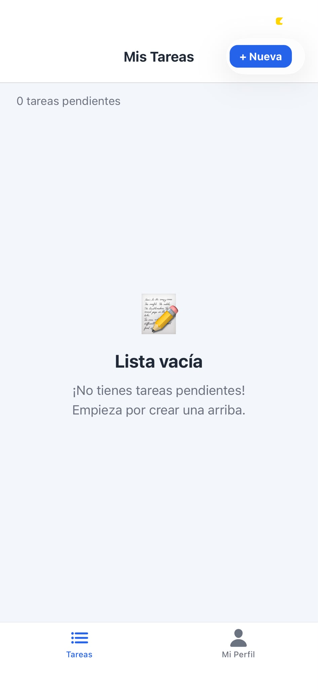
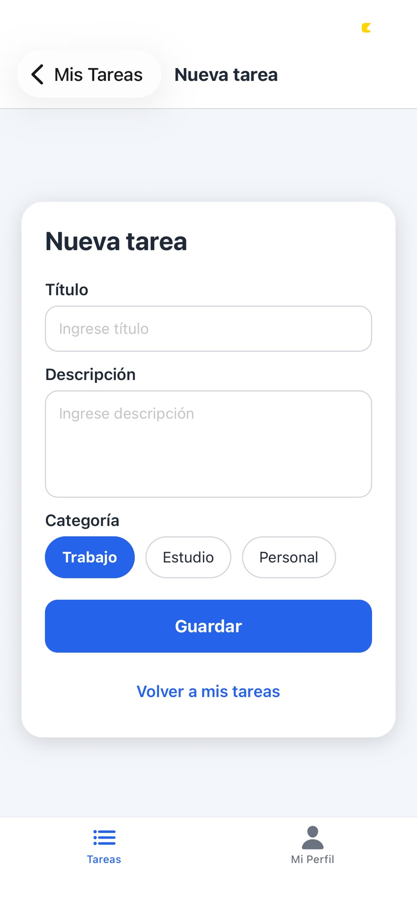
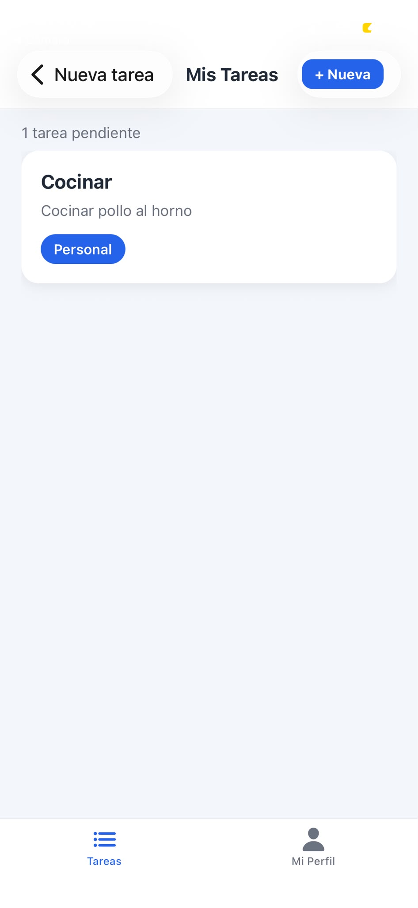
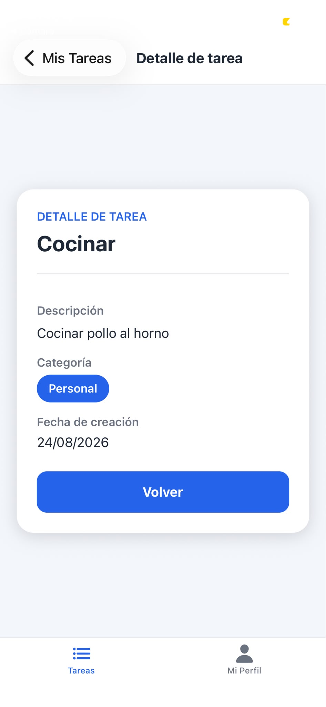
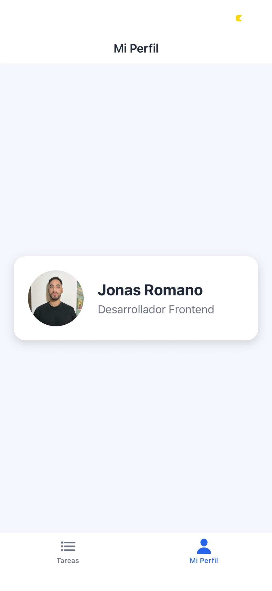

# TaskFlow

TaskFlow es una aplicación móvil desarrollada con React Native y Expo. Su objetivo es ayudar a los usuarios a organizar y gestionar sus tareas de forma sencilla e intuitiva.

## Tecnologías utilizadas

- React Native
- Expo
- JavaScript

## Ejecución del proyecto

1. Instalar las dependencias:

```bash
npm install
```

2. Iniciar la aplicación:

```bash
npx expo start
```

3. Abrir la aplicación utilizando:
- Expo Go.
- Un emulador de Android.
- Un simulador de iOS (macOS).

## Checkpoint 1

En este primer checkpoint se desarrolló:

- Configuración inicial del proyecto con Expo.
- Componente de bienvenida.
- Pantalla principal con el título **TaskFlow**.
- Subtítulo **"Checkpoint 1: Estructura Base"**.
- Estilos implementados con `StyleSheet`.

## Checkpoint 1 - Estructura Base

En este checkpoint se desarrolló la arquitectura inicial de la aplicación TaskFlow siguiendo una organización profesional de carpetas.

### Estructura implementada

Dentro de la carpeta `src` se crearon:

- `components/`
  - `ProfileCard.js`

- `screens/`
  - `HomeScreen.js`
  - `ProfileScreen.js`

- `assets/`
  - Recursos gráficos de la aplicación.

- `constants/`
  - `colors.js` para centralizar los colores del diseño.

### Componentes desarrollados

#### ProfileCard

Se creó un componente reutilizable para mostrar información del usuario.

Características:

- Recibe datos mediante props:
  - `name`
  - `role`
  - `image`

- Utiliza el componente `Image` de React Native para mostrar el avatar.
- Implementa estilos con `StyleSheet.create`.
- Diseño con tarjeta, bordes redondeados, padding y sombras.

### Pantallas creadas

#### HomeScreen

Pantalla inicial preparada para mostrar las tareas del usuario.

#### ProfileScreen

Pantalla que renderiza el componente `ProfileCard` con datos de prueba:

- Nombre del usuario.
- Rol.
- Imagen de perfil.

### Sistema de estilos

Se creó un archivo de constantes para mantener una identidad visual consistente:

- Colores principales.
- Fondo.
- Texto.
- Elementos de tarjeta.

### Visualización

Actualmente la aplicación permite visualizar la `ProfileScreen` funcionando correctamente mediante Expo.

## Checkpoint 2 - Navegación

Hasta este checkpoint el cambio de pantalla lo hacía a mano: un estado en
`App.js` que decidía si mostrar "home" o "add", y adentro de `HomeScreen` otro
estado más para mostrar el detalle de una tarea. Andaba, pero no era
navegación real. Acá lo reemplacé por React Navigation.

Quedó así:

- Un Tab Navigator arriba de todo, con las pestañas **Home** y **Perfil**.
- Adentro de Home metí un Stack Navigator: `TaskList` → `TaskDetail` → `TaskForm`.

Ahora, al tocar una tarea, la pantalla de detalle se apila arriba de la
lista, y si volvés atrás (con la flecha del header o con el botón "Volver")
te devuelve exactamente a donde estabas. La pestaña Perfil queda afuera de
todo ese stack, aparte.

**Archivos nuevos:**

- `src/navigation/AppNavigator.js`: el Tab Navigator y el Stack anidado.
- `src/screens/TaskDetailScreen.js`: antes era un componente que `HomeScreen`
  mostraba a mano con un estado local; ahora es una pantalla que recibe los
  datos por parámetros.
- `src/context/TasksContext.js`: para que `HomeScreen` y `AddTaskScreen`
  compartan la lista de tareas sin pasarse props entre pantallas. Esto lo voy
  a reemplazar por Redux en el próximo módulo.

Al tocar una tarea en la lista:

```js
navigation.navigate('TaskDetail', { id: item.id, title: item.title });
```

Y `TaskDetailScreen` los recupera con `useRoute()`.

Cuando guardás una tarea nueva, en vez de volver con un `onBack` como antes,
ahora hago:

```js
navigation.navigate('TaskList');
```

## Checkpoint 3 - Estado Global con Redux Toolkit

Hasta acá las tareas vivían en `TasksContext` (un Context + `useState`), que
el propio código dejaba claro que era temporal: "un puente hasta el Módulo 6".
En este checkpoint ese puente se cae y todo pasa a un store de Redux Toolkit.

Quedó así:

- `src/store/taskSlice.js`: el slice `tasks`, con estado `{ items, filter }`
  y los reducers `addTask`, `toggleTaskStatus`, `deleteTask` y `setFilter`.
  El `id` único y la fecha de creación de cada tarea los genera el propio
  reducer (con `prepare`), no el componente que dispara la acción.
- `src/store/store.js`: `configureStore` con el reducer `tasks`.
- `App.js`: ahora envuelve todo con `<Provider store={store}>` en vez de
  `<TasksProvider>`.

Las pantallas dejaron de manejar la lista con `useState`:

- `HomeScreen` lee las tareas con `useSelector` (ya filtradas por el
  filtro activo) y tiene tres chips (Todas / Pendientes / Completadas) que
  hacen `dispatch(setFilter(...))`.
- `AddTaskScreen` reemplazó `addTask` del Context por
  `dispatch(addTask(...))`.
- `TaskDetailScreen` agrega dos acciones nuevas: marcar la tarea como
  completada/pendiente (`toggleTaskStatus`) y eliminarla (`deleteTask`).
  Como todo sale del store, al volver a la lista el cambio ya está
  reflejado sin pasar nada por props ni por parámetros de navegación.

El filtro también vive en el store, así que si lo cambio en Home y navego
a otra pestaña y vuelvo, sigue seleccionado — no se resetea como pasaría
con un estado local del componente.

**Dependencias nuevas:** `@reduxjs/toolkit` y `react-redux`.

## Capturas

**Lista vacía**


**Nueva tarea**


**Mis tareas**


**Detalle de tarea**


**Mi Perfil**

