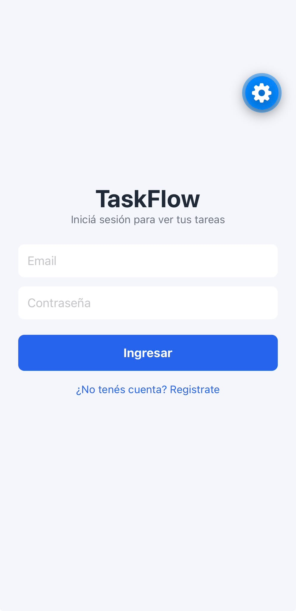
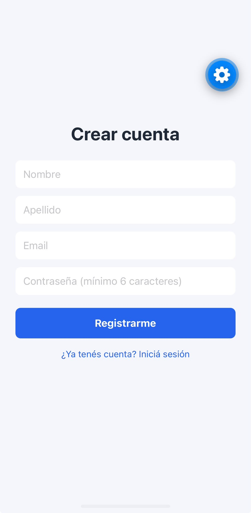
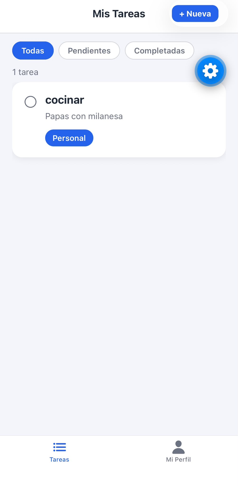
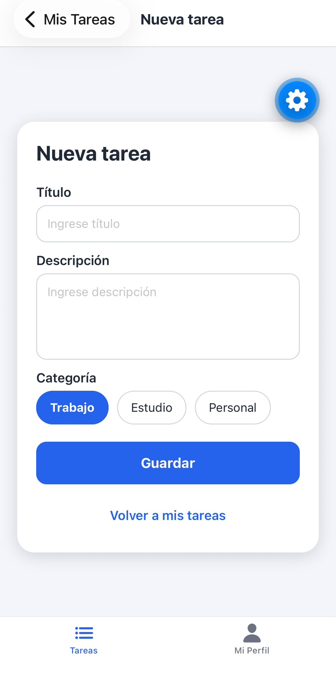
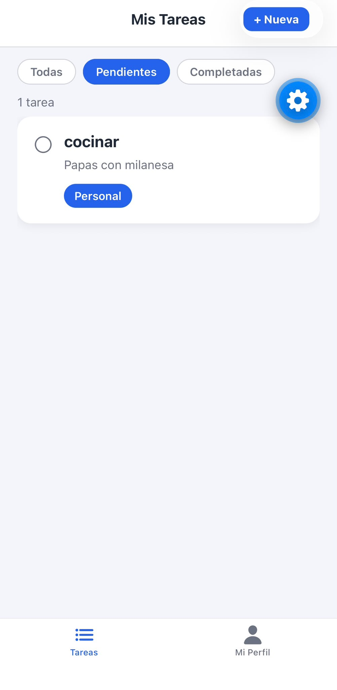
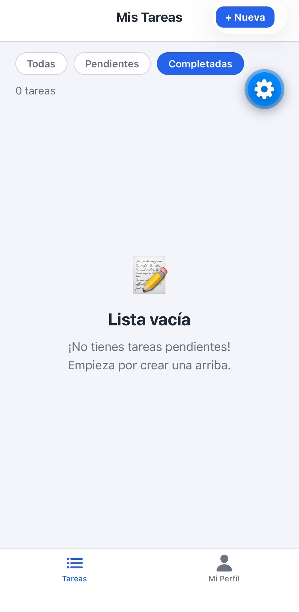
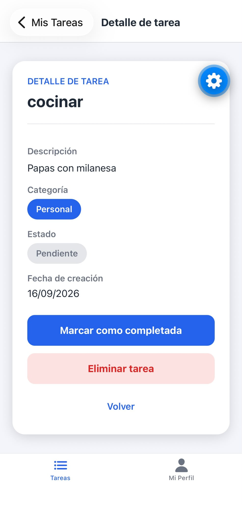
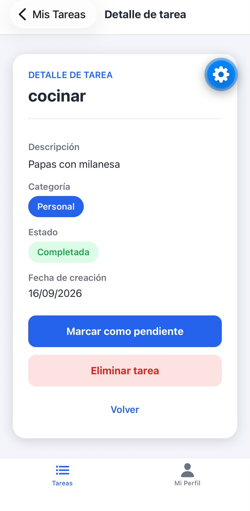
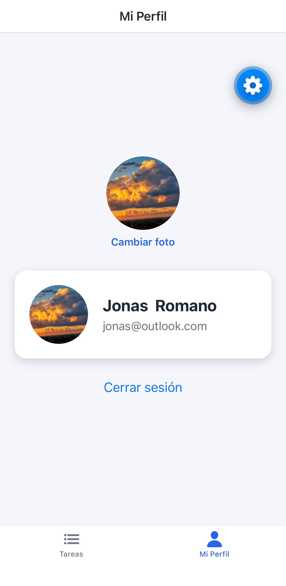

# 📱 TaskFlow

TaskFlow es una aplicación móvil de gestión de tareas desarrollada con **React Native y Expo**.

El proyecto permite a los usuarios registrarse, iniciar sesión, crear y administrar tareas, consultar su detalle, completar tareas y mantener la información sincronizada mediante **Firebase Cloud Firestore**.

Además, cuenta con gestión de perfil y selección de imagen mediante `Expo Image Picker`.

---

# 🚀 Tecnologías utilizadas

- React Native
- Expo
- JavaScript
- Redux Toolkit
- React Redux
- React Navigation
- Firebase Authentication
- Cloud Firestore
- AsyncStorage
- Expo Image Picker

---

# 📋 Funcionalidades

## 🔐 Autenticación

La aplicación utiliza **Firebase Authentication** para gestionar los usuarios.

Funcionalidades:

- Registro de nuevos usuarios.
- Inicio de sesión.
- Persistencia de sesión.
- Cierre de sesión.
- Identificación del usuario mediante su UID.
- Protección de los datos asociados a cada usuario.

---

## 📝 Gestión de tareas

TaskFlow permite administrar tareas personales.

Funcionalidades:

- Crear nuevas tareas.
- Visualizar tareas.
- Consultar el detalle de una tarea.
- Marcar tareas como completadas.
- Mantener tareas pendientes.
- Eliminar tareas.
- Filtrar tareas.
- Asociar cada tarea al usuario autenticado.
- Almacenar las tareas en Cloud Firestore.

Las tareas utilizan diferentes categorías:

- Trabajo
- Estudio
- Personal

También se aplican validaciones al momento de crear una tarea.

---

## 🔎 Filtros de tareas

La pantalla principal permite filtrar las tareas según su estado:

- Todas
- Pendientes
- Completadas

Los filtros son administrados mediante el estado global de Redux.

---

## ☁️ Firebase y Firestore

Firebase se utiliza como backend de la aplicación.

### Firebase Authentication

Se utiliza para:

- Registrar usuarios.
- Iniciar sesión.
- Mantener la sesión.
- Cerrar sesión.

### Cloud Firestore

Las tareas se almacenan en Firestore y se asocian al usuario autenticado mediante su `userId`.

Los documentos de las tareas contienen información como:

- `title`
- `description`
- `category`
- `userId`
- `completed`
- `createdAt`

La aplicación utiliza una suscripción a Firestore para mantener las tareas sincronizadas en tiempo real.

---

# 🏗️ Arquitectura del proyecto

El proyecto está organizado separando las responsabilidades de la aplicación entre componentes, pantallas, navegación, servicios y estado global.

```text
TaskFlow/
│
├── docs/
│   └── screenshots/
│
├── src/
│   ├── assets/
│   │
│   ├── components/
│   │
│   ├── constants/
│   │
│   ├── navigation/
│   │
│   ├── screens/
│   │
│   ├── services/
│   │
│   └── store/
│
├── .env.example
├── .gitignore
├── App.js
├── app.json
├── eas.json
├── index.js
├── package.json
├── package-lock.json
└── README.md
```

---

# 📂 Estructura principal

## `src/components`

Contiene los componentes reutilizables de la aplicación.

Entre ellos se encuentran componentes relacionados con:

- Tareas.
- Formularios.
- Perfil.
- Visualización de información.

---

## `src/screens`

Contiene las diferentes pantallas de TaskFlow.

Entre ellas:

- Pantalla de inicio.
- Pantalla de autenticación.
- Pantalla de registro.
- Pantalla para agregar tareas.
- Pantalla de detalle de tarea.
- Pantalla de perfil.

---

## `src/navigation`

Contiene la configuración de navegación de la aplicación.

Se utiliza:

- `Native Stack Navigator`
- `Bottom Tab Navigator`

La navegación permite acceder a las diferentes secciones de la aplicación y administrar el flujo entre pantallas.

---

## `src/services`

Contiene la lógica encargada de comunicarse con los servicios externos.

### Firebase

Se encarga de inicializar y configurar Firebase para utilizar:

- Authentication.
- Cloud Firestore.

### Task Service

Centraliza las operaciones relacionadas con las tareas:

- Obtener tareas.
- Crear tareas.
- Actualizar tareas.
- Eliminar tareas.
- Suscribirse a los cambios de Firestore.

---

# 🔄 Redux Toolkit

TaskFlow utiliza **Redux Toolkit** para administrar el estado global de la aplicación.

El Store centraliza la información necesaria para que diferentes pantallas y componentes puedan acceder al estado de la aplicación.

## Estado de autenticación

El estado de autenticación permite mantener la información del usuario actual.

## Estado de tareas

El estado de tareas administra:

- Lista de tareas.
- Filtro seleccionado.
- Estado de las tareas.
- Operaciones asincrónicas.
- Actualización de datos provenientes de Firestore.

La comunicación entre Redux y Firestore se realiza mediante los servicios definidos en `src/services`.

---

# 💾 Persistencia

La aplicación utiliza diferentes mecanismos de persistencia.

## Firestore

Las tareas se almacenan en **Cloud Firestore**, permitiendo conservar los datos y sincronizarlos con la aplicación.

## AsyncStorage

`AsyncStorage` se utiliza para conservar información local de la aplicación.

Entre otros usos, permite mantener la imagen de perfil seleccionada por el usuario.

---

# 👤 Perfil de usuario

La aplicación cuenta con una sección de perfil.

Desde esta sección el usuario puede:

- Consultar su información.
- Seleccionar una imagen desde la galería.
- Cambiar su imagen de perfil.
- Mantener la imagen seleccionada mediante almacenamiento local.

Para seleccionar la imagen se utiliza:

```text
expo-image-picker
```

La aplicación solicita los permisos necesarios para acceder a las imágenes del dispositivo.

---

# 🔐 Seguridad de Firestore

Las reglas de Firestore se utilizan para restringir el acceso a los datos de los usuarios.

La aplicación trabaja utilizando el UID del usuario autenticado.

Esto permite establecer una relación entre:

```text
Usuario
   ↓
userId
   ↓
Tareas del usuario
```

De esta forma, las operaciones sobre las tareas se realizan asociándolas al usuario correspondiente.

---

# ⚙️ Variables de entorno

El proyecto utiliza variables de entorno para configurar Firebase.

El repositorio incluye:

```text
.env.example
```

Este archivo sirve como plantilla para configurar las variables necesarias.

Las variables utilizadas son:

```env
EXPO_PUBLIC_FIREBASE_API_KEY=
EXPO_PUBLIC_FIREBASE_AUTH_DOMAIN=
EXPO_PUBLIC_FIREBASE_PROJECT_ID=
EXPO_PUBLIC_FIREBASE_STORAGE_BUCKET=
EXPO_PUBLIC_FIREBASE_MESSAGING_SENDER_ID=
EXPO_PUBLIC_FIREBASE_APP_ID=
```

## Configuración

Después de clonar el proyecto, crear un archivo:

```text
.env
```

en la raíz del proyecto y completar las variables con la configuración correspondiente del proyecto de Firebase.

El archivo `.env` no debe subirse al repositorio.

Para configurar el proyecto se puede utilizar `.env.example` como referencia.

---

# 📦 Instalación

## 1. Clonar el repositorio

```bash
git clone https://github.com/JonasRomano24/TaskFlow.git
```

## 2. Ingresar al proyecto

```bash
cd TaskFlow
```

## 3. Instalar las dependencias

```bash
npm install
```

## 4. Configurar Firebase

Crear el archivo `.env` a partir de `.env.example` y completar las variables de Firebase.

## 5. Iniciar Expo

```bash
npx expo start
```

---

# ▶️ Ejecución

Una vez iniciado Expo, la aplicación puede ejecutarse mediante:

- Expo Go.
- Emulador Android.
- Dispositivo Android compatible.
- Simulador iOS en macOS.

Para iniciar directamente en Android:

```bash
npm run android
```

Para iniciar la aplicación en web:

```bash
npm run web
```

---

# 📱 Build de Android

La aplicación fue compilada utilizando **Expo Application Services (EAS)**.

El APK generado permite instalar y probar TaskFlow directamente en un dispositivo Android.

### APK

[Descargar / instalar APK de TaskFlow](https://expo.dev/artifacts/eas/mkL01dL66Ks0TvkN-Odld3U99juvbSLN_qL2pYamGC0.apk)

---

# 📸 Evidencia visual

Las siguientes capturas muestran las principales funcionalidades implementadas en TaskFlow.

Todas las imágenes se encuentran dentro de:

```text
docs/screenshots/
```

---

## 🔐 Inicio de sesión

Pantalla de inicio de sesión mediante Firebase Authentication.



---

## 📝 Registro

Pantalla para registrar un nuevo usuario.



---

## 📋 Todas las tareas

Visualización de las tareas disponibles para el usuario.



---

## ➕ Nueva tarea

Formulario utilizado para crear una nueva tarea.



---

## ⏳ Tareas pendientes

Visualización de las tareas que todavía no fueron completadas.



---

## ✅ Tareas completadas

Filtro que permite visualizar las tareas completadas.



---

## 🔎 Detalle de tarea

Pantalla donde se puede consultar la información completa de una tarea.



---

## ✅ Detalle de tarea completada

Visualización del detalle de una tarea después de marcarla como completada.



---

## 👤 Perfil

Pantalla de perfil del usuario.



---

# 🔄 Flujo principal de la aplicación

El funcionamiento general de TaskFlow puede resumirse de la siguiente manera:

```text
           Registro / Login
                  │
                  ▼
        Usuario autenticado
                  │
                  ▼
          Pantalla principal
                  │
          ┌───────┴───────┐
          │               │
          ▼               ▼
    Lista de tareas     Perfil
          │
    ┌─────┼──────┐
    │     │      │
    ▼     ▼      ▼
 Crear  Detalle  Filtros
 tarea   tarea
    │     │      │
    └─────┴──────┘
          │
          ▼
       Firestore
          │
          ▼
    Sincronización
          │
          ▼
        Redux
          │
          ▼
     Interfaz UI
```

---

# 🧪 Validaciones

El formulario de creación de tareas cuenta con validaciones para evitar el ingreso de información insuficiente.

Entre las validaciones implementadas:

- El título debe cumplir con una longitud mínima.
- La descripción debe cumplir con una longitud mínima.
- Se selecciona una categoría para cada tarea.
- Se evita crear tareas con información inválida.

---

# 🗂️ Modelo de datos

Las tareas almacenadas en Firestore utilizan una estructura similar a:

```javascript
{
  title: "Título de la tarea",
  description: "Descripción de la tarea",
  category: "Trabajo",
  userId: "UID_DEL_USUARIO",
  completed: false,
  createdAt: ...
}
```

El campo `userId` permite relacionar cada tarea con el usuario autenticado.

---

# 🔄 Sincronización con Firestore

TaskFlow utiliza una suscripción a los cambios de Firestore.

Cuando se produce una modificación en las tareas:

```text
Firestore
    ↓
Listener
    ↓
taskService
    ↓
Redux
    ↓
Componentes
    ↓
Interfaz actualizada
```

Esto permite mantener actualizada la lista de tareas sin necesidad de recargar manualmente la aplicación.

---

# 📚 Dependencias principales

Las principales tecnologías y librerías utilizadas se encuentran definidas en `package.json`.

Entre ellas:

- Expo.
- React Native.
- Redux Toolkit.
- React Redux.
- Firebase.
- React Navigation.
- AsyncStorage.
- Expo Image Picker.

Las versiones exactas utilizadas pueden consultarse directamente en:

```text
package.json
```

---

# 💻 Código fuente

El código fuente completo del proyecto se encuentra disponible en el siguiente repositorio:

**GitHub — TaskFlow**

https://github.com/JonasRomano24/TaskFlow

El repositorio contiene:

- Código fuente.
- Componentes.
- Pantallas.
- Navegación.
- Redux Toolkit.
- Servicios Firebase.
- Configuración de Firestore.
- Configuración de Expo.
- `.env.example`.
- Capturas de pantalla.
- Documentación técnica.

---

# 📱 Entrega

## Código fuente

https://github.com/JonasRomano24/TaskFlow

## APK Android

https://expo.dev/artifacts/eas/mkL01dL66Ks0TvkN-Odld3U99juvbSLN_qL2pYamGC0.apk

---

# 👨‍💻 Autor

**Jonas Romano**

Proyecto desarrollado como parte de la formación en Desarrollo de Aplicaciones.

**TaskFlow — Aplicación móvil de gestión de tareas**